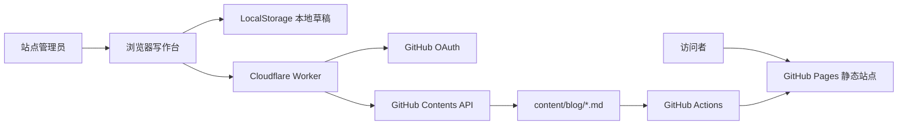

# LSA Portfolio & Browser Blog CMS

一个基于 React、Vite、GitHub Pages 和 Cloudflare Workers 的个人主页与轻量博客发布系统。


[](https://react.dev/)
[](https://vite.dev/)
[](https://pages.github.com/)
[](https://developers.cloudflare.com/workers/)

## 在线访问

- 个人主页：<https://lshan02508-ai.github.io/>
- 博客列表：<https://lshan02508-ai.github.io/#/blog>

> 写作后台的本地草稿无需服务端即可使用。直接发布到 GitHub 需要部署 Worker 并配置 GitHub OAuth。

## 功能特性


### 博客系统

- 每篇文章保存为独立 Markdown 文件
- GFM 表格、任务列表、删除线和代码块
- 安全的 Markdown 内容过滤
- 基于 Hash 的静态路由，适配 GitHub Pages
- 推送 `main` 后自动构建和发布

### 浏览器写作台

- MDXEditor 所见即所得编辑
- 富文本、Markdown 源码、差异对比三种模式
- 标题、列表、引用、链接、图片和表格
- 多语言代码块编辑
- 搜索、新建、编辑和删除文章
- 浏览器本地草稿与撤销
- GitHub OAuth 身份验证
- 一键发布、更新或删除线上文章
- 后台按需加载，不增加主页首屏负担

## 系统架构



公开网站保持为纯静态页面。GitHub Client Secret、OAuth 令牌交换、用户校验和仓库写入全部位于 Worker，敏感信息不会进入前端构建产物。

## 技术栈

| 模块 | 技术 |
| --- | --- |
| 前端 | React 19、TypeScript、Vite 8 |
| 编辑器 | MDXEditor、Lexical、CodeMirror |
| Markdown 渲染 | react-markdown、remark-gfm、rehype-sanitize |
| 静态托管 | GitHub Pages |
| 自动部署 | GitHub Actions |
| 发布 API | Cloudflare Workers |
| 仓库写入 | GitHub Contents API |
| 包管理 | pnpm 11 |

## 快速开始

### 环境要求

- Node.js 22.13 或更高版本
- pnpm 11
- Git

### 安装与运行

```bash
git clone https://github.com/lshan02508-ai/lshan02508-ai.github.io.git
cd lshan02508-ai.github.io
pnpm install
pnpm run dev
```

默认开发地址以终端输出为准。写作后台使用 Hash 路由：

```text
http://localhost:5173/#/admin
```

### 构建与测试

```bash
pnpm run build
pnpm run test
pnpm run lint
```

静态产物生成到 `dist/`。

## 项目结构

```text
.
├─ app/
│  ├─ admin.tsx                  # 写作后台与草稿 CRUD
│  ├─ blog-content.tsx           # Frontmatter 解析与文章索引
│  ├─ markdown-renderer.tsx      # 安全 Markdown 渲染
│  ├─ rich-markdown-editor.tsx   # MDXEditor 配置
│  ├─ page.tsx                   # 个人主页内容
│  └─ globals.css                # 全站样式
├─ admin-worker/
│  └─ index.ts                   # OAuth 与 GitHub 发布接口
├─ content/blog/                 # Markdown 文章目录
├─ public/                       # 图片、Logo 与字体
├─ src/main.tsx                  # Vite 入口与 Hash 路由
├─ tests/                        # 构建与集成检查
├─ wrangler.admin.jsonc          # Worker 配置
└─ .github/workflows/
   └─ deploy-pages.yml           # GitHub Pages 工作流
```

## 编写博客文章

文章位于 `content/blog/`，文件名建议与 `slug` 保持一致：

```markdown
---
title: 一篇示例文章
slug: example-article
category: AI Agent
date: 2026.08.17
readingTime: 6 分钟
excerpt: 显示在博客列表中的简短摘要。
lead: 显示在文章标题下面的导语。
---

## 问题背景

从这里开始编写正文。

## 方法与实践

- 支持 GFM 列表
- 支持表格和任务列表
- 支持代码块
```

也可以打开 `/#/admin`，使用可视化编辑器创建和维护文章。

## 部署到 GitHub Pages

### 使用自己的仓库

1. Fork 本仓库，或复制代码到你的 `<username>.github.io` 仓库。
2. 修改 `app/page.tsx` 中的个人信息。
3. 替换 `public/` 中的头像、Logo 和项目资源。
4. 修改 `wrangler.admin.jsonc` 中的仓库、账号和域名。
5. 在仓库 `Settings → Pages` 中将 Source 设置为 **GitHub Actions**。
6. 推送到 `main`，工作流会自动构建并发布。

### 日常更新命令

```bash
git status
git add .
git commit -m "update site content"
git push origin main
```

可以在仓库的 `Actions` 页面查看构建进度。发布完成后，如果浏览器仍显示旧页面，可以等待片刻并强制刷新。

## 配置浏览器一键发布

### 1. 修改 Worker 配置

复制项目后，修改 `wrangler.admin.jsonc`：

```jsonc
{
  "vars": {
    "GITHUB_OWNER": "你的 GitHub 用户名",
    "GITHUB_REPO": "你的仓库名",
    "GITHUB_BRANCH": "main",
    "ALLOWED_GITHUB_LOGIN": "允许发布的 GitHub 账号",
    "ALLOWED_ORIGINS": "https://你的站点域名,http://localhost:5173"
  }
}
```

### 2. 部署 Cloudflare Worker

```bash
pnpm exec wrangler login
pnpm run admin:deploy
```

记录部署后的地址：

```text
https://lsa-blog-admin.<subdomain>.workers.dev
```

### 3. 创建 GitHub OAuth App

进入 GitHub：

```text
Settings → Developer settings → OAuth Apps → New OAuth App
```

填写：

```text
Homepage URL:
https://你的站点域名

Authorization callback URL:
https://你的-worker.workers.dev/auth/callback
```

创建后保存 `Client ID`，并生成 `Client Secret`。

### 4. 配置 Worker 密钥

```bash
pnpm exec wrangler secret put GITHUB_CLIENT_ID --config wrangler.admin.jsonc
pnpm exec wrangler secret put GITHUB_CLIENT_SECRET --config wrangler.admin.jsonc
pnpm exec wrangler secret put SESSION_SECRET --config wrangler.admin.jsonc
```

`SESSION_SECRET` 应使用至少 32 字符的随机字符串，不能提交到 Git 仓库。

### 5. 配置前端 Worker 地址

在 GitHub 仓库中进入：

```text
Settings → Secrets and variables → Actions → Variables
```

添加仓库变量：

```text
BLOG_ADMIN_API_URL=https://你的-worker.workers.dev
```

重新运行 Pages 工作流。之后打开 `/#/admin`，通过 GitHub 登录即可发布。

后台左下角也可以临时填写 Worker 地址，该设置仅保存在当前浏览器。

## 安全设计

- GitHub Client Secret 仅保存在 Cloudflare Worker Secret 中。
- Worker 会检查登录账号是否与 `ALLOWED_GITHUB_LOGIN` 一致。
- 发布路径被限制为 `content/blog/<slug>.md`。
- Slug 仅允许小写字母、数字和连字符。
- 编辑器会话采用 AES-GCM 加密，并在一小时后过期。
- OAuth state 使用加密载荷和 HttpOnly Cookie 校验。
- Worker 仅允许配置的站点来源跨域访问。
- 公开文章使用 `rehype-sanitize` 过滤不安全内容。

## 常用脚本

| 命令 | 说明 |
| --- | --- |
| `pnpm run dev` | 启动网站开发服务器 |
| `pnpm run build` | 构建 GitHub Pages 静态文件 |
| `pnpm run start` | 预览构建结果 |
| `pnpm run test` | 执行构建与集成测试 |
| `pnpm run lint` | 运行 ESLint |
| `pnpm run admin:dev` | 本地启动发布 Worker |
| `pnpm run admin:deploy` | 部署发布 Worker |

## 二次开发建议

- 首页内容集中在 `app/page.tsx`，可以替换为 JSON 或 CMS 数据源。
- 主题变量位于 `app/globals.css` 顶部的 `:root`。
- 如需图片上传，可在 Worker 中增加 GitHub 图片目录写入接口，并接入 MDXEditor `imageUploadHandler`。
- 如需多人协作，建议把单账号 OAuth 改造成 GitHub App，并增加角色与审核流程。
- 如需草稿跨设备同步，可以增加 Cloudflare D1 或 KV 存储。

## 贡献

欢迎通过 Issue 讨论问题或提交 Pull Request。提交代码前请运行：

```bash
pnpm run build
pnpm run test
pnpm run lint
```

## 许可证

当前仓库尚未添加项目级 `LICENSE` 文件，因此代码默认保留全部权利。若计划允许其他人复制、修改和分发，请由仓库所有者明确选择并添加许可证，例如 MIT 或 Apache-2.0。
